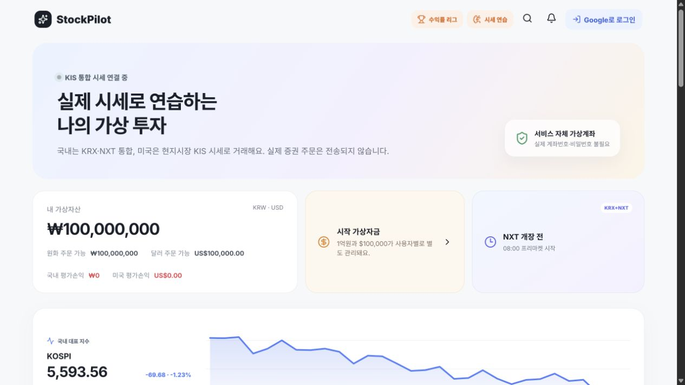

# StockPilot

> 실제 한국·미국 주식 시세로 연습하는 웹 기반 가상투자 서비스

<p>
  <a href="https://stockpilot.coders.kr">
    
  </a>
  <a href="https://apiportal.koreainvestment.com/">
    
  </a>
  
</p>

**바로 사용하기:** [https://stockpilot.coders.kr](https://stockpilot.coders.kr)

StockPilot은 한국투자증권 KIS Open API의 국내 KRX·NXT 통합 시세와 미국 주식 시세를 이용하는 웹 기반 모의투자 서비스입니다. KOSPI 흐름과 주요 종목을 확인하고, 원하는 종목을 검색해 서비스가 지급한 가상 원화·달러 자산으로 매매를 연습할 수 있습니다. 관심종목, 목표가 푸시, 투자 리포트, 시세 리플레이와 수익률 리그까지 한 서비스에서 제공합니다.

실제 증권계좌로 주문을 전송하지 않으며 계좌번호나 계좌 비밀번호도 요구하지 않습니다.

<p align="center">
  <a href="https://stockpilot.coders.kr">
    
  </a>
</p>

## 핵심 기능

| 영역 | 제공 기능 |
|---|---|
| 시장 한눈에 보기 | KOSPI 최근 30거래일 그래프, 전일 대비 등락, 5분 자동 갱신 |
| 실시간 시장 | 국내 KRX·NXT 통합 시세, 미국 주식 시세, 시장 운영 상태 |
| 종목 탐색 | 실제 기업 로고가 적용된 한국·미국 TOP 10, 종목명·종목코드·티커 통합 검색 |
| 가상 매매 | 시장가, 지정가, 손절·돌파, 조건부 지정가, 미체결 주문 취소 |
| 주문 안전장치 | 보유·대기 주문 수량 검증, 초과 매도 차단, 전량 매도, 예수금 부족 안내 |
| 자산 관리 | KRW·USD 가상 예수금, 보유 종목, 평균 매입가, 평가손익 |
| 투자 분석 | 기간별 수익률, 실현손익, 승률, 체결 수, 모의 거래비용 |
| 수익률 리그 | 공개 리그, 초대형 시즌 리그, 순위와 순위 변화 |
| 기업 정보 | OpenDART 회사 개요, 핵심 재무지표, 최근 공시 |
| 학습 기능 | 과거 시세 리플레이, 투자 미션, 종목별 KIS 뉴스 5분 자동 갱신 |
| 관심·알림 | 관심종목, 목표가격 알림, 읽지 않은 알림 배지 |
| 웹 푸시 | Firebase Cloud Messaging 기반 목표가 도달 브라우저 알림 |
| 사용자 | Google 로그인, 사용자별 가상자산·주문·리그 기록 분리 |

### 데이터 갱신 기준

| 데이터 | 화면 반영 | 비고 |
|---|---:|---|
| 주요 종목 현재가 | 약 1초 | KIS 실시간 스트림, 장애 시 REST 보완 |
| 검색 종목 현재가 | 요청 시 즉시 | 선택 종목을 실시간 구독 목록에 추가 |
| KOSPI 그래프 | 5분 | 최근 30거래일 일별 지수, KIS 응답 캐시 적용 |
| 종목 뉴스 | 5분 | 선택한 종목 기준 자동 갱신, 수동 새로고침 지원 |
| 알림·투자 도구 | 15초 | 목표가 도달 및 읽지 않은 알림 상태 반영 |

## 주요 화면과 사용 흐름

### 1. KOSPI 시장 흐름 확인

메인 화면에서 KOSPI 현재 지수, 전일 대비 등락과 최근 30거래일 종가 그래프를 확인합니다. 그래프는 KIS 일별 지수 데이터를 사용하며 5분마다 자동 갱신됩니다. API가 일시적으로 불안정하면 마지막 정상 데이터를 유지해 화면이 갑자기 비지 않도록 처리합니다.

### 2. 실시간 주요 종목 확인

한국과 미국 시장의 주요 종목을 한 화면에서 확인합니다. 국내 시세는 KRX와 NXT를 합친 통합 시장 기준이며, 종목을 선택하면 현재가와 주문 화면이 함께 표시됩니다. TOP 20에는 각 회사의 실제 브랜드 로고를 우선 표시하고, 외부 이미지가 응답하지 않으면 안전하게 종목 이니셜로 대체합니다.

### 3. 원하는 종목 검색

TOP 10에 없는 종목도 종목명, 국내 종목코드 또는 미국 티커로 검색할 수 있습니다. 검색 결과에서 종목을 선택하면 동일한 가상 주문 기능을 사용할 수 있습니다.

<p align="center">
  
</p>

### 4. 실제 시세 기반 가상 매매

- 국내 주식은 가상 원화 예수금으로 거래합니다.
- 미국 주식은 가상 달러 예수금으로 거래합니다.
- 시장가와 계획 주문을 지원하며 미체결 지정가 주문은 취소할 수 있습니다.
- 미보유 종목과 보유 수량을 넘는 매도는 주문 전에 차단합니다.
- 대기 중인 매도 주문 수량을 별도로 계산해 중복 매도를 방지합니다.
- 체결 시 모의 수수료와 국내 매도 비용을 가상 잔고에 반영합니다.
- 모든 거래는 StockPilot 내부 가상 원장에만 기록됩니다.

### 5. 포트폴리오와 투자 리포트

보유 수량, 평균 매입가, 현재 평가금액, 평가손익과 수익률을 확인할 수 있습니다. 투자 리포트에서는 국내·미국 수익률, 실현손익, 체결 수, 승률, 거래비용과 일별 추이를 제공합니다.

### 6. 수익률 리그

[수익률 리그](https://stockpilot.coders.kr/league)는 가상투자 결과로 다른 사용자와 경쟁하는 기능입니다.

- 모든 사용자는 동일한 `₩1억 + US$10만`으로 시작합니다.
- 한국 계좌와 미국 계좌 수익률을 50:50으로 합산합니다.
- 공개 순위에는 닉네임, 순위, 수익률과 순위 변화만 표시합니다.
- 보유 종목, 매매 내역, 잔고, Google 실명과 이메일은 공개하지 않습니다.
- 친구와 7~90일 동안 경쟁하는 초대형 비공개 시즌 리그를 만들 수 있습니다.

### 7. 관심종목과 목표가 푸시 알림

관심종목과 목표가격을 등록하면 목표가 도달 시 상단 알림 배지와 브라우저 푸시로 알려줍니다. 로그인 후 `나의 투자 도구 → 관심·알림 → 푸시 알림 켜기`에서 기기를 등록할 수 있습니다.

### 8. 종목 뉴스

`나의 투자 도구 → 종목 뉴스`에서 현재 선택한 회사의 최신 KIS 뉴스 제목을 확인합니다. 탭을 열면 즉시 조회하고 이후 5분마다 조용히 갱신하며, 마지막 갱신 시각과 수동 새로고침 버튼을 함께 표시합니다.

## 서비스 구조

```text
사용자 브라우저
  └─ Next.js 16 / React 19
       └─ FastAPI
            ├─ KIS Open API
            │    ├─ 국내 KRX·NXT 통합 시세
            │    ├─ 미국 주식 시세·뉴스
            │    └─ KOSPI 일별 지수
            ├─ OpenDART
            │    └─ 기업 개요·재무·공시
            ├─ Google OAuth 2.0
            │    └─ 로그인·사용자 세션
            ├─ Firebase Cloud Messaging
            │    └─ 목표가 도달 웹 푸시
            └─ PostgreSQL
                 └─ 가상 잔고·보유 종목·주문·리그·알림
```

KIS Open API는 **종목과 시세 조회에만** 사용합니다. 사용자가 제출한 매수·매도 주문은 StockPilot의 PostgreSQL 가상 원장에 저장되며 한국투자증권으로 전송되지 않습니다.

### 주요 API

| Method | Endpoint | 역할 |
|---|---|---|
| `GET` | `/api/trading/quotes` | 한국·미국 TOP 10 시세 |
| `GET` | `/api/trading/search` | 전체 종목 검색 |
| `GET` | `/api/trading/quote` | 선택 종목 현재가 |
| `GET` | `/api/trading/kospi` | KOSPI 현재 지수와 30거래일 그래프 데이터 |
| `POST` | `/api/trading/orders` | 서비스 내부 가상주문 접수 |
| `GET` | `/api/features/news` | 선택 종목 뉴스 |
| `GET` | `/api/features/dashboard` | 관심종목·알림·투자 리포트 |
| `GET` | `/api/league/leaderboard` | 공개 수익률 순위 |

## 기술 스택

| 영역 | 기술 |
|---|---|
| Frontend | Next.js 16, React 19, TypeScript |
| Backend | Python, FastAPI, SQLAlchemy Async |
| Database | PostgreSQL 16, Alembic |
| Authentication | Google OAuth 2.0, 서버 세션 쿠키 |
| Market Data | 한국투자증권 KIS Open API |
| Company Data | 금융감독원 OpenDART |
| Push Notification | Firebase Cloud Messaging, Web Push |
| Infrastructure | Docker, Docker Compose, coders.kr |

## 주요 디렉터리

```text
backend/
  app/
    routes/
      auth.py             Google 로그인과 세션
      trading.py          시세·검색·가상 주문
      league.py           리그 참여·수익률·순위
      company.py          OpenDART 기업정보
      engagement.py       관심종목·알림·리포트·미션
    services/
      firebase_push.py    Firebase 푸시 발송
      price_alert_notifier.py
                          목표가 감시 작업
  alembic/versions/       데이터베이스 마이그레이션

frontend/
  app/                    페이지와 전역 스타일
  components/
    TradingTerminal.tsx   종목·검색·주문·포트폴리오
    MarketIndexChart.tsx  KOSPI 30거래일 지수 그래프
    StockLogo.tsx         실제 브랜드 로고와 대체 표시
    LeagueBoard.tsx       공개 수익률 리그
    LeagueRooms.tsx       초대형 시즌 리그
    CompanyInsight.tsx    기업 개요·재무·공시
    InvestorTools.tsx     관심종목·알림·리포트·미션
    PracticeLab.tsx       과거 시세 리플레이
  public/
    firebase-messaging-sw.js
                          백그라운드 푸시 서비스 워커

compose.yaml              로컬 개발 환경
coders.yaml               coders.kr 배포 설정
```

## 로컬 실행

### 1. 환경 변수 준비

```bash
cp backend/.env.example backend/.env
```

`backend/.env`에 필요한 값을 입력합니다.

```dotenv
KIS_ENV=paper
KIS_APP_KEY=
KIS_APP_SECRET=
DART_API_KEY=

GOOGLE_CLIENT_ID=
GOOGLE_CLIENT_SECRET=
GOOGLE_REDIRECT_URI=http://localhost:3000/api/auth/google/callback

AUTH_SESSION_SECRET=
AUTH_COOKIE_SECURE=false
FIREBASE_SERVICE_ACCOUNT_B64=

SIMULATION_FEE_RATE=0.00015
SIMULATION_KR_SELL_TAX_RATE=0.002
```

Google Auth Platform의 승인된 리디렉션 URI에도 다음 주소를 등록합니다.

```text
http://localhost:3000/api/auth/google/callback
```

`AUTH_SESSION_SECRET`은 최소 32바이트 이상의 무작위 문자열을 사용하세요. API Key, App Secret, 서비스 계정 JSON은 Git에 커밋하지 마세요.

### 2. 실행

```bash
docker compose up
```

- 웹: [http://localhost:3000](http://localhost:3000)
- API: [http://localhost:8000](http://localhost:8000)
- 상태 확인: [http://localhost:8000/api/health](http://localhost:8000/api/health)

## 운영 환경 Secret

배포 환경에는 다음 Secret이 필요합니다.

- `KIS_APP_KEY`
- `KIS_APP_SECRET`
- `DART_API_KEY`
- `GOOGLE_CLIENT_ID`
- `GOOGLE_CLIENT_SECRET`
- `AUTH_SESSION_SECRET`
- `FIREBASE_SERVICE_ACCOUNT_B64`

운영 Google OAuth 리디렉션 URI:

```text
https://stockpilot.coders.kr/api/auth/google/callback
```

## 주의사항

- StockPilot은 모의투자 서비스이며 실제 주식 주문을 전송하지 않습니다.
- 화면의 시세는 제공처 정책, 장 운영 시간과 네트워크 상태에 따라 지연될 수 있습니다.
- 기업 로고와 상표는 각 권리자에게 있으며 종목 식별 목적으로만 표시합니다.
- 수수료와 세금은 학습을 위한 모의 설정값이며 실제 과세 판단에 사용할 수 없습니다.
- 서비스의 정보는 투자 권유 또는 투자 자문이 아닙니다.
- 실제 서비스 운영 시 각 데이터 제공 API의 이용약관과 재배포 정책을 확인해야 합니다.
