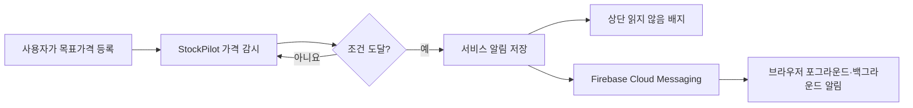
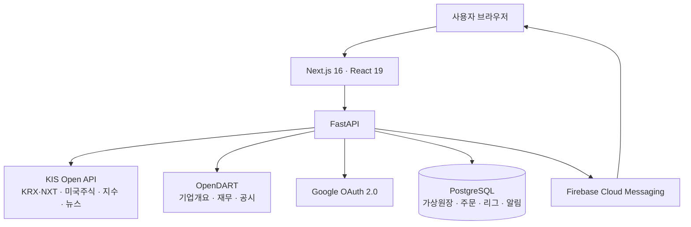

<div align="center">

# StockPilot

### 실제 시세로 배우고, 가상자산으로 겨루는 주식 투자 연습 서비스

한국 `KRX·NXT 통합 시세`와 미국 주식 시세를 보면서<br />
검색 → 분석 → 가상주문 → 성과 확인 → 수익률 리그까지 한 번에 경험합니다.

<p>
  <a href="https://stockpilot.coders.kr">
    
  </a>
  <a href="https://github.com/boclair98/stockpilot">
    
  </a>
</p>

<p>
  
  
  
  
</p>

<a href="https://stockpilot.coders.kr">
  
</a>

**[지금 StockPilot 사용하기 →](https://stockpilot.coders.kr)**

</div>

> [!IMPORTANT]
> StockPilot의 모든 매수·매도는 서비스 내부 가상원장에만 기록됩니다. 실제 증권계좌로 주문을 보내지 않으며, 계좌번호나 계좌 비밀번호를 요구하지 않습니다.

---

## StockPilot이 제공하는 경험

| 1. 시장 확인 | 2. 종목 탐색 | 3. 판단 | 4. 가상주문 | 5. 성장 |
|---|---|---|---|---|
| KOSPI와 TOP 10 확인 | 전체 종목 검색 | 차트·공시·뉴스 확인 | 4가지 주문 방식 | 리포트·미션·리그 |
| KRX·NXT / 미국장 | 최근 본 종목 | 관심종목·목표가 | 주문 안전장치 | 공개·친구 시즌전 |

StockPilot은 단순한 현재가 조회 화면이 아닙니다. 사용자가 실제 투자 앱에서 거치는 흐름을 가상 환경에서 처음부터 끝까지 연습하도록 설계했습니다.

```text
Google 로그인
    ↓
₩100,000,000 + US$100,000 가상자산 지급
    ↓
실시간 시장 확인 → 종목 검색 → 가격 흐름·기업정보 확인
    ↓
가상 매수·매도 → 포트폴리오·투자 리포트 확인
    ↓
목표가 알림·학습 미션 → 수익률 리그 참여
```

## 화면 미리보기

<table>
  <tr>
    <td align="center" width="58%">
      
      <br />
      <b>시장·자산 대시보드</b>
      <br />
      <sub>가상자산, 장 운영 상태, 한국·미국 주요 종목을 한 화면에서 확인</sub>
    </td>
    <td align="center" width="42%">
      
      <br />
      <b>전체 종목 검색</b>
      <br />
      <sub>종목명, 국내 종목코드, 미국 티커로 검색한 뒤 바로 분석·주문</sub>
    </td>
  </tr>
</table>

---

## 전체 기능 지도

아래 기능은 현재 운영 서비스에서 실제로 사용할 수 있습니다.

| 영역 | 기능 | 사용자가 얻는 것 |
|---|---|---|
| 시장 | KOSPI 30거래일 그래프 | 국내 시장의 최근 흐름과 전일 대비 등락 확인 |
| 시장 | 한국·미국 실시간 TOP 10 | 많이 찾는 종목의 가격을 빠르게 비교 |
| 시장 | KRX·NXT 통합 장 상태 | 국내 대체거래소를 포함한 현재 거래 세션 확인 |
| 탐색 | 전체 종목 통합 검색 | TOP 10에 없는 종목도 이름·코드·티커로 찾기 |
| 탐색 | 최근 본 종목 6개 | 다시 검색하지 않고 이전 종목으로 이동 |
| 탐색 | 실제 회사 로고 | 카드에서 기업을 빠르게 식별, 실패 시 이니셜 대체 |
| 분석 | 1주·1개월·3개월 차트 | 기간 수익률, 고가, 저가, 최근 종가 확인 |
| 분석 | OpenDART 기업정보 | 대표자, 설립일, 결산월, 홈페이지 확인 |
| 분석 | 핵심 재무정보 | 최근 공시 기준 주요 재무 수치를 간단히 확인 |
| 분석 | 최근 공시 | 최근 1년 공시 5건과 DART 원문 링크 확인 |
| 분석 | 종목 뉴스 | 선택 종목 관련 KIS 뉴스, 5분 자동 갱신 |
| 거래 | 원화·달러 가상계좌 | 국내·미국 투자를 서로 다른 통화로 연습 |
| 거래 | 시장가 | 현재 시세를 기준으로 즉시 가상체결 |
| 거래 | 지정가 | 원하는 가격에 도달했을 때 체결 |
| 거래 | 손절·돌파 주문 | 감시 가격을 통과하면 시장가 방식으로 체결 |
| 거래 | 조건부 지정가 | 감시 가격 도달 후 지정가 조건으로 대기·체결 |
| 거래 | 간편 수량 | 주문 가능 자금·수량의 10·25·50·100% 입력 |
| 거래 | 주문 확인창 | 제출 전 종목, 방향, 방식, 수량, 예상금액 재확인 |
| 거래 | 주문 취소 | 아직 체결되지 않은 대기 주문 취소 |
| 안전 | 초과 매도 차단 | 미보유·보유 초과·중복 대기 매도를 서버와 화면에서 차단 |
| 안전 | 예수금 검증 | 가상 예수금보다 큰 매수 주문 체결 차단 |
| 안전 | 모의 비용 반영 | 수수료와 국내 매도 비용을 가상 성과에 반영 |
| 자산 | 포트폴리오 | 수량, 평균단가, 현재가, 평가액, 손익, 수익률 확인 |
| 성과 | 투자 리포트 | 실현손익, 승률, 체결 수, 비용, 자산 배분, 추이 확인 |
| 관심 | 관심종목 | 다시 보고 싶은 종목 저장 및 즉시 이동 |
| 알림 | 목표가 알림 | 현재가 이상·이하 조건을 등록하고 도달 여부 확인 |
| 알림 | 브라우저 푸시 | Firebase를 통한 포그라운드·백그라운드 웹 알림 |
| 알림 | 읽지 않음 배지 | 새로 발생한 가격 알림 수를 상단에서 확인 |
| 학습 | 시세 리플레이 | 미래 가격을 가린 과거 차트로 하루씩 투자 판단 |
| 학습 | 6개 투자 미션 | 첫 거래부터 분산투자·리그 참여까지 단계별 학습 |
| 경쟁 | 공개 수익률 리그 | 보유 종목은 숨기고 닉네임·수익률·순위만 경쟁 |
| 경쟁 | 비공개 시즌 리그 | 초대코드로 친구와 7·14·30·60일 시즌 진행 |
| 사용자 | Google 로그인 | 하나의 Google 계정으로 가상자산과 기록 보존 |
| 사용자 | 사용자별 데이터 분리 | 잔고, 주문, 관심종목, 알림, 리그 기록을 계정별 관리 |

---

## 기능을 하나씩 알아보기

### 01. 시장 대시보드

서비스에 들어오면 주문보다 먼저 시장 전체 흐름을 볼 수 있습니다.

| 화면 요소 | 표시 내용 | 갱신 |
|---|---|---:|
| 내 가상자산 | 원화·달러 주문 가능 금액, 국내·미국 평가손익 | 약 5초 |
| 국내 대표 지수 | KOSPI 현재 지수, 전일 대비 값·등락률 | 5분 |
| 지수 그래프 | 최근 완료된 30거래일 종가 | 5분 |
| 국내 장 상태 | KRX·NXT 세션과 다음 개장 안내 | 상태 변경 반영 |
| 실시간 TOP 10 | 한국 10개, 미국 10개 주요 종목 | 약 1초 |

- 국내 종목은 **KRX와 NXT를 합친 통합 시세**를 사용합니다.
- 미국 종목은 해당 거래소의 KIS 해외주식 시세를 사용합니다.
- 실시간 스트림이 잠시 끊기면 REST 조회로 보완하고 마지막 정상 데이터를 유지합니다.
- 종목 로고를 가져오지 못해도 카드가 깨지지 않도록 회사 이니셜을 표시합니다.

### 02. 전체 종목 검색과 최근 본 종목

메인 TOP 10은 빠른 진입용일 뿐, 거래 가능한 종목을 TOP 10으로 제한하지 않습니다.

1. 검색창에 `삼성전자`, `005930`, `Apple`, `AAPL`처럼 입력합니다.
2. 한국·미국 종목 마스터에서 이름, 종목코드 또는 티커가 일치하는 결과를 보여줍니다.
3. 결과를 누르면 해당 종목의 현재가를 조회하고 실시간 구독 목록에 추가합니다.
4. 가격 차트, 기업정보, 뉴스, 관심종목, 목표가, 주문창이 같은 종목으로 바뀝니다.
5. 최근 확인한 종목은 최대 6개까지 브라우저에 남아 다시 바로 선택할 수 있습니다.

검색 결과에는 종목명, 심볼, 시장·거래소 정보가 함께 표시되어 이름이 비슷한 상품을 구분할 수 있습니다.

### 03. 선택 종목 가격 흐름

종목을 선택하면 주문창 위에서 먼저 가격 흐름을 확인합니다.

- `1주`, `1개월`, `3개월` 기간 전환
- 선택 기간의 시작 종가 대비 등락률
- 기간 내 최고가와 최저가
- 가장 최근 완료 거래일의 종가
- 국내·미국 모두 최대 80거래일의 KIS 일별 시세 사용

장중에 아직 끝나지 않은 날짜가 과거 차트를 왜곡하지 않도록, 완료된 거래일을 기준으로 기간 통계를 계산합니다.

### 04. 기업정보·재무·공시

국내 상장 종목은 금융감독원 **OpenDART 공식 데이터**를 함께 보여줍니다.

| 구분 | 표시 항목 |
|---|---|
| 회사 개요 | 한글·영문 회사명, 대표자, 설립일, 시장, 결산월 |
| 공식 링크 | 회사 홈페이지 |
| 핵심 재무 | 최근 공시 보고서 기준 주요 재무 지표와 연결·별도 범위 |
| 최근 공시 | 최근 1년 공시 중 최신 5건, 제출인, 공시일 |
| 원문 확인 | 각 공시의 DART 원문 새 창 연결 |

해외 종목에는 국내 전자공시 정보가 적용되지 않으므로 이 영역을 노출하지 않습니다.

### 05. 종목 뉴스

`나의 투자 도구 → 종목 뉴스`에서 현재 보고 있는 종목의 관련 뉴스를 확인합니다.

- 종목을 바꾸면 새 종목 뉴스를 즉시 조회
- 탭을 열어 둔 동안 **5분마다 자동 갱신**
- 수동 새로고침 버튼 제공
- 뉴스 제목, 출처, 날짜·시각, 마지막 갱신 시각 표시
- 새로고침 중에도 기존 목록을 유지해 화면 깜빡임 최소화

### 06. 원화·달러 가상계좌

Google로 처음 로그인하면 사용자마다 별도의 가상계좌가 생성됩니다.

| 계좌 | 시작 자금 | 거래 대상 |
|---|---:|---|
| 원화 계좌 | `₩100,000,000` | 한국 주식 |
| 달러 계좌 | `US$100,000` | 미국 주식 |

한국과 미국 주문은 각각 해당 통화의 가상 예수금에서 처리합니다. 환전이나 실제 입출금 기능은 없으며, 다른 사용자의 자산과 섞이지 않습니다.

### 07. 네 가지 가상주문

| 주문 방식 | 매수 체결 조건 | 매도 체결 조건 | 용도 |
|---|---|---|---|
| 시장가 | 현재 시세로 즉시 | 현재 시세로 즉시 | 바로 매수·매도 |
| 지정가 | 현재가가 지정가 이하 | 현재가가 지정가 이상 | 원하는 가격을 미리 지정 |
| 손절·돌파 | 현재가가 감시가 이상 | 현재가가 감시가 이하 | 돌파 매수·손절 매도 연습 |
| 조건부 지정가 | 감시가 이상 도달 후 지정가 이하 | 감시가 이하 도달 후 지정가 이상 | 조건 발동 후 가격까지 통제 |

주문 화면에서는 다음 정보를 함께 제공합니다.

- 현재 주문 가능한 원화·달러 금액
- 보유 수량, 대기 매도 수량, 실제 매도 가능 수량
- 현재가 기준 최대 매수 가능 수량
- `10%`, `25%`, `50%`, `100%` 간편 수량 버튼
- 매도 시 `전량` 버튼
- 예상 주문금액
- 주문 제출 전 최종 확인 모달
- 최근 주문 30건과 체결·대기·취소·거절 상태
- 대기 중인 지정가·조건 주문 취소

### 08. 주문 안전장치

실수로 잘못된 주문을 만들지 않도록 브라우저와 서버가 모두 검증합니다.

| 상황 | StockPilot의 처리 |
|---|---|
| 보유하지 않은 종목 매도 | “보유하지 않은 종목은 매도할 수 없습니다” 안내 후 차단 |
| 보유 수량보다 많은 매도 | 최대 매도 가능 수량 안내 후 차단 |
| 같은 주식의 매도 주문이 이미 대기 중 | 대기 수량을 예약 수량으로 빼고 남은 수량만 허용 |
| 가상 예수금보다 큰 매수 | 체결 거절과 예수금 부족 안내 |
| 수량 0 또는 음수 | 주문 전 차단 |
| 필요한 지정가·감시가 누락 | 입력 항목을 안내하고 주문 접수 거절 |
| 체결된 주문 취소 시도 | 대기 중인 주문만 취소할 수 있다고 안내 |

체결 금액에는 운영 환경의 모의 수수료율을 적용하며, 국내 주식 매도에는 별도의 모의 매도 비용도 반영합니다. 이 값은 학습용 설정이며 실제 증권사 수수료·세금 계산기가 아닙니다.

### 09. 포트폴리오와 투자 리포트

#### 포트폴리오

- 종목별 보유 수량
- 평균 매입가
- 현재가
- 매입원가와 평가금액
- 평가손익과 종목 수익률
- 원화·달러 잔여 예수금
- 최근 주문과 실현손익

#### 투자 리포트

- 원화 계좌 수익률
- 달러 계좌 수익률
- 두 시장을 50:50으로 합산한 통합 수익률
- 누적 실현손익
- 전체 체결 수
- 매도 거래 승률
- 누적 모의 수수료·비용
- 종목별 자산 배분
- 일별 수익률 추이 스파크라인

현재가가 변하면 평가금액과 미실현 손익도 함께 갱신됩니다.

### 10. 관심종목과 목표가 알림

보고 있는 종목을 관심종목으로 저장하거나 가격 조건을 만들 수 있습니다.

1. 종목을 선택합니다.
2. `관심·알림` 탭에서 관심종목에 추가합니다.
3. `이 가격 이상` 또는 `이 가격 이하`를 선택하고 목표가격을 입력합니다.
4. 백엔드가 현재 시세와 목표가격을 비교합니다.
5. 조건이 충족되면 상단 알림 배지, 화면 안내, 브라우저 푸시에 반영합니다.
6. 사용자는 알림을 읽음 처리하거나 삭제할 수 있습니다.

목표가격을 입력하는 동안 실시간 현재가가 바뀌어도 입력값은 덮어쓰지 않습니다.

#### 웹 푸시 전달 경로



브라우저 알림은 사용자가 직접 권한을 허용하고 `푸시 알림 켜기`를 선택한 기기에서만 동작합니다.

### 11. 과거 시세 리플레이

**[시세 연습 화면 열기 →](https://stockpilot.coders.kr/practice)**

미래 가격을 모르는 상태에서 판단하는 연습 모드입니다.

- 삼성전자, SK하이닉스, Apple, Tesla 연습 프리셋
- KIS 과거 일별 시세를 처음 일부만 공개
- `다음 거래일 공개`를 눌러 하루씩 진행
- 각 날짜의 시가, 고가, 저가, 종가, 거래량 확인
- 별도의 연습 예수금으로 가상 매수·매도
- 보유 수량, 평균단가, 총자산, 수익률 실시간 계산
- 연습 거래 기록 최대 6건 표시
- 미래 데이터는 다음 날을 열기 전까지 차트에서 숨김
- 언제든 처음부터 다시 시작

이 모드의 거래는 메인 가상계좌나 수익률 리그 기록에 영향을 주지 않습니다.

### 12. 단계별 투자 미션

| 미션 | 완료 조건 | 배우는 행동 |
|---|---|---|
| 첫 가상투자 | 첫 주문 체결 | 주문 흐름 이해 |
| 관심종목 수집가 | 관심종목 3개 저장 | 관찰 목록 만들기 |
| 가격 감시 시작 | 목표가 알림 생성 | 계획 가격 설정 |
| 계획적인 투자자 | 지정가·손절 주문 사용 | 조건 주문 이해 |
| 분산투자 입문 | 서로 다른 종목 3개 보유 | 분산 개념 체험 |
| 리그 데뷔 | 수익률 리그 참여 | 성과 비교 시작 |

각 미션은 현재 진행 수치, 목표 수치, 완료 여부를 보여줍니다.

### 13. 공개 수익률 리그

**[수익률 리그 열기 →](https://stockpilot.coders.kr/league)**

“무엇을 샀는지”가 아니라 “얼마나 잘 운용했는지”만 비교합니다.

| 리그 규칙 | 내용 |
|---|---|
| 시작 조건 | 모든 사용자에게 동일한 `₩1억 + US$10만` |
| 점수 | 한국 계좌 수익률 50% + 미국 계좌 수익률 50% |
| 갱신 | 순위 화면 약 15초 자동 갱신, 수동 새로고침 지원 |
| 노출 | 상위 100명 |
| 공개 | 리그 닉네임, 현재 순위, 누적 수익률, 순위 변화 |
| 비공개 | 보유 종목, 주문 내역, 잔고, 실명, 이메일 |

사용자는 2~12자의 별도 리그 닉네임을 정하거나 익명 닉네임을 자동 생성할 수 있으며, 리그에서 나가도 가상투자 기록은 유지됩니다.

### 14. 친구와 비공개 시즌 리그

공개 순위와 별개로 초대코드를 아는 사람만 참여하는 리그를 만들 수 있습니다.

- 리그 이름과 공개 닉네임 설정
- `7일`, `14일`, `30일`, `60일` 시즌 선택
- 자동 생성된 초대코드 복사
- 초대코드 입력으로 참여
- 참여한 시점의 가상자산을 기준값으로 저장
- 시즌 참여 이후 수익률만 계산
- 방별 상위 5명 순위 표시
- 진행 전·진행 중·종료 상태 구분
- 약 20초마다 참여 리그 현황 자동 갱신

### 15. Google 로그인과 사용자 데이터

- 로그인 공급자는 Google 하나만 제공합니다.
- OAuth 인증이 끝나면 서버 세션 쿠키를 발급합니다.
- 가상 예수금, 보유 종목, 주문, 관심종목, 목표가, 푸시 기기, 미션, 리그 기록은 사용자 ID로 분리합니다.
- API Key, Google Client Secret, Firebase 서비스 계정은 브라우저 번들에 포함하지 않고 서버 Secret으로만 관리합니다.
- 로그아웃하면 인증이 필요한 주문·개인 기능을 사용할 수 없습니다.

---

## 데이터 출처와 갱신 주기

| 데이터 | 출처 | 화면 반영 | 장애 시 처리 |
|---|---|---:|---|
| 한국 주요 종목 현재가 | KIS KRX·NXT 통합 시세 | 약 1초 | REST 보완·마지막 정상값 유지 |
| 미국 주요 종목 현재가 | KIS 해외주식 시세 | 약 1초 | REST 보완·마지막 정상값 유지 |
| 검색 종목 현재가 | KIS 종목별 조회 | 선택 즉시 | 오류 메시지와 재시도 |
| 종목 일별 차트 | KIS 국내·해외 기간별 시세 | 종목·기간 선택 시 | 기존 화면 유지 |
| KOSPI 지수 | KIS 지수 현재가·일별 시세 | 5분 | 캐시된 마지막 정상값 유지 |
| 기업 개요·재무·공시 | 금융감독원 OpenDART | 국내 종목 선택 시 | 사용 가능한 영역만 표시 |
| 종목 뉴스 | KIS 뉴스 | 즉시 + 5분 | 기존 기사 목록 유지 |
| 포트폴리오 | StockPilot 가상원장 + KIS 현재가 | 약 5초 | 마지막 계산값 유지 |
| 관심종목·목표가·리포트 | StockPilot 가상원장 | 15초 | 다음 주기에 재시도 |
| 공개 리그 | StockPilot 가상원장 | 15초 | 수동 새로고침 가능 |
| 비공개 리그 | StockPilot 가상원장 | 20초 | 수동 재진입 시 재조회 |

> [!NOTE]
> “실시간”은 KIS가 제공하는 시세 스트림을 약 1초 간격으로 화면에 반영한다는 의미입니다. 거래소, 데이터 제공 정책, 장 운영 시간, 네트워크 상황에 따라 지연될 수 있습니다.

---

## 공개되는 정보와 보호되는 정보

| 정보 | 본인 화면 | 공개 리그 | 다른 사용자 |
|---|:---:|:---:|:---:|
| 리그 닉네임 | ✅ | ✅ | ✅ |
| 순위·수익률·순위 변화 | ✅ | ✅ | ✅ |
| Google 이름·이메일 | ✅ | ❌ | ❌ |
| 보유 종목·수량 | ✅ | ❌ | ❌ |
| 주문·체결 내역 | ✅ | ❌ | ❌ |
| 원화·달러 잔고 | ✅ | ❌ | ❌ |
| 관심종목·목표가격 | ✅ | ❌ | ❌ |
| 등록된 푸시 기기 | ✅ | ❌ | ❌ |

리그 공개 API 응답에도 비공개 항목을 포함하지 않습니다.

---

## 서비스 구조



KIS Open API는 **종목, 시세, 지수, 뉴스 조회에만** 사용합니다. 사용자가 만든 주문은 FastAPI가 StockPilot의 PostgreSQL 가상원장에서 처리하며 한국투자증권 주문 API로 보내지 않습니다.

### 기술 스택

| 영역 | 기술 |
|---|---|
| Frontend | Next.js 16, React 19, TypeScript |
| Backend | Python, FastAPI, SQLAlchemy Async |
| Database | PostgreSQL 16, Alembic |
| Authentication | Google OAuth 2.0, 서버 세션 쿠키 |
| Market Data | 한국투자증권 KIS Open API |
| Company Data | 금융감독원 OpenDART |
| Push | Firebase Cloud Messaging, Web Push |
| Infrastructure | Docker, Docker Compose, coders.kr |

### 주요 API

| Method | Endpoint | 역할 | 인증 |
|---|---|---|:---:|
| `GET` | `/api/auth/status` | 현재 로그인 상태 | 선택 |
| `GET` | `/api/auth/google/login` | Google 로그인 시작 | 없음 |
| `POST` | `/api/auth/logout` | 세션 종료 | 필요 |
| `GET` | `/api/trading/quotes` | 한국·미국 TOP 10 시세 | 없음 |
| `GET` | `/api/trading/search` | 전체 종목 검색 | 없음 |
| `GET` | `/api/trading/quote` | 선택 종목 현재가 | 없음 |
| `GET` | `/api/trading/market-status` | KRX·NXT·미국장 상태 | 없음 |
| `GET` | `/api/trading/kospi` | KOSPI 현재값·30거래일 | 없음 |
| `GET` | `/api/trading/portfolio` | 가상 잔고·보유·주문 | 선택 |
| `POST` | `/api/trading/orders` | 가상주문 접수 | 필요 |
| `DELETE` | `/api/trading/orders/{id}` | 대기 주문 취소 | 필요 |
| `WS` | `/api/trading/ws` | 실시간 시세 스트림 | 없음 |
| `GET` | `/api/company/{symbol}` | 국내 기업정보·재무·공시 | 없음 |
| `GET` | `/api/features/history` | 국내·미국 일별 시세 | 없음 |
| `GET` | `/api/features/news` | 선택 종목 뉴스 | 없음 |
| `GET` | `/api/features/dashboard` | 관심·알림·리포트·미션 | 선택 |
| `POST` | `/api/features/watchlist` | 관심종목 저장 | 필요 |
| `POST` | `/api/features/alerts` | 목표가 알림 생성 | 필요 |
| `POST` | `/api/features/push/devices` | 푸시 기기 등록 | 필요 |
| `GET` | `/api/league/rankings` | 공개 리그 순위 | 선택 |
| `POST` | `/api/league/join` | 공개 리그 참여 | 필요 |
| `GET` | `/api/league/rooms` | 내 시즌 리그 | 필요 |
| `POST` | `/api/league/rooms` | 시즌 리그 생성 | 필요 |
| `POST` | `/api/league/rooms/join` | 초대코드 참여 | 필요 |

### 주요 디렉터리

```text
backend/
  app/
    routes/
      auth.py             Google 로그인·세션
      trading.py          시세·검색·포트폴리오·가상주문
      company.py          OpenDART 기업정보
      engagement.py       관심종목·알림·리포트·미션·뉴스
      league.py           공개·비공개 수익률 리그
    services/
      instrument_catalog.py
                          한국·미국 종목 마스터
      kis_market.py       KIS 시세·지수·뉴스
      dart_company.py     OpenDART 조회·정규화
      price_alert_notifier.py
                          목표가 감시
      firebase_push.py    FCM 푸시 전송
  alembic/versions/       데이터베이스 마이그레이션

frontend/
  app/
    page.tsx              메인 가상투자
    practice/page.tsx     과거 시세 리플레이
    league/page.tsx       공개·비공개 리그
  components/
    TradingTerminal.tsx   시장·검색·주문·포트폴리오
    MarketIndexChart.tsx  KOSPI 그래프
    StockTrendPanel.tsx   종목 기간별 차트
    CompanyInsight.tsx    기업 개요·재무·공시
    InvestorTools.tsx     관심·알림·리포트·미션·뉴스
    PracticeLab.tsx       과거 시세 연습
    LeagueBoard.tsx       공개 수익률 리그
    LeagueRooms.tsx       초대형 시즌 리그
  public/
    firebase-messaging-sw.js
                          백그라운드 푸시 서비스 워커

compose.yaml              로컬 개발 환경
coders.yaml               coders.kr 배포 설정
```

<details>
<summary><b>로컬에서 실행하기</b></summary>

### 1. 환경 변수 준비

```bash
cp backend/.env.example backend/.env
```

`backend/.env`에 개발용 값을 입력합니다.

```dotenv
KIS_ENV=paper
KIS_APP_KEY=
KIS_APP_SECRET=
DART_API_KEY=

GOOGLE_CLIENT_ID=
GOOGLE_CLIENT_SECRET=
GOOGLE_REDIRECT_URI=http://localhost:3000/api/auth/google/callback

AUTH_SESSION_SECRET=
AUTH_COOKIE_SECURE=false
FIREBASE_SERVICE_ACCOUNT_B64=

SIMULATION_FEE_RATE=0.00015
SIMULATION_KR_SELL_TAX_RATE=0.002
```

Google Auth Platform의 승인된 리디렉션 URI에도 다음 주소를 등록합니다.

```text
http://localhost:3000/api/auth/google/callback
```

`AUTH_SESSION_SECRET`은 최소 32바이트 이상의 무작위 문자열을 사용하세요.

### 2. 실행

```bash
docker compose up
```

| 서비스 | 주소 |
|---|---|
| Web | [http://localhost:3000](http://localhost:3000) |
| API | [http://localhost:8000](http://localhost:8000) |
| Health Check | [http://localhost:8000/api/health](http://localhost:8000/api/health) |

</details>

<details>
<summary><b>운영 환경 Secret</b></summary>

배포 환경에는 다음 Secret이 필요합니다.

- `KIS_APP_KEY`
- `KIS_APP_SECRET`
- `DART_API_KEY`
- `GOOGLE_CLIENT_ID`
- `GOOGLE_CLIENT_SECRET`
- `AUTH_SESSION_SECRET`
- `FIREBASE_SERVICE_ACCOUNT_B64`

운영 Google OAuth 리디렉션 URI:

```text
https://stockpilot.coders.kr/api/auth/google/callback
```

API Key, App Secret, OAuth Secret, Firebase 서비스 계정 JSON은 Git에 커밋하지 않습니다.

</details>

---

## 서비스 원칙

- **실제 시세, 가상 체결:** 시장 데이터는 실제 제공 API를 사용하지만 주문은 서비스 내부에서만 처리합니다.
- **실수 방지:** 주문 전 확인과 서버 검증을 함께 적용합니다.
- **성과는 공개, 전략은 비공개:** 리그에서는 수익률만 비교하고 보유 종목과 거래 내역은 숨깁니다.
- **학습 우선:** 수익률 경쟁뿐 아니라 시세 리플레이와 단계별 미션을 제공합니다.
- **데이터 출처 표시:** KIS와 OpenDART의 역할을 화면과 문서에서 구분합니다.

## 이용 전 확인

- StockPilot은 모의투자·학습 서비스이며 실제 주식 주문을 전송하지 않습니다.
- 시세는 제공처 정책, 장 운영 시간, 네트워크 상태에 따라 지연될 수 있습니다.
- 수수료와 국내 매도 비용은 학습용 모의 설정값이며 실제 과세 판단에 사용할 수 없습니다.
- 기업 로고와 상표는 각 권리자에게 있으며 종목 식별 목적으로만 표시합니다.
- 서비스의 시세, 뉴스, 기업정보, 순위는 투자 권유 또는 투자 자문이 아닙니다.
- 실제 운영자는 각 데이터 제공 API의 이용약관과 재배포 정책을 준수해야 합니다.

---

<div align="center">

### 설명을 읽었으면, 이제 실제 흐름을 경험해 보세요.

**[가상투자 시작하기](https://stockpilot.coders.kr)** ·
**[시세 연습](https://stockpilot.coders.kr/practice)** ·
**[수익률 리그](https://stockpilot.coders.kr/league)**

문제나 개선 제안은 [GitHub Issues](https://github.com/boclair98/stockpilot/issues)에 남겨 주세요.

</div>
