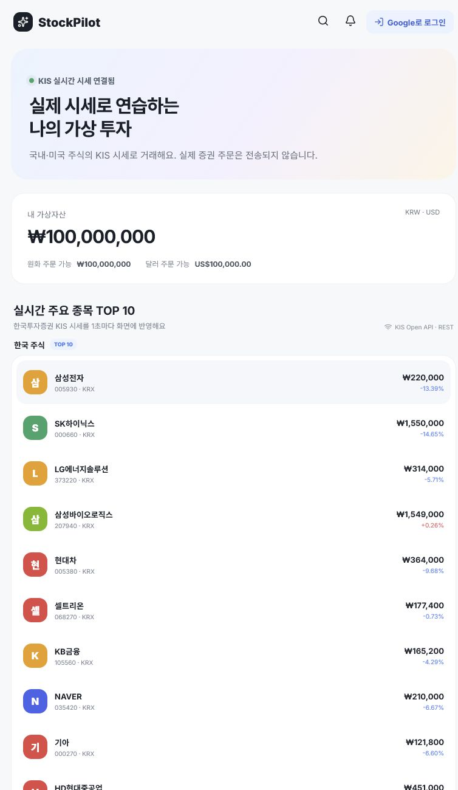
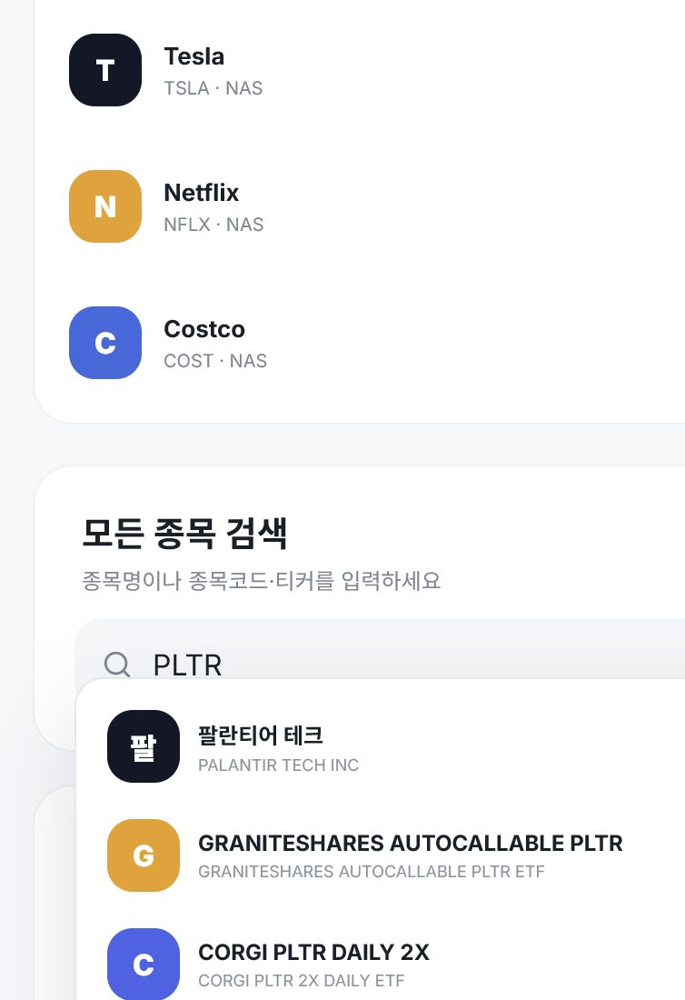

# StockPilot

> 한국·미국 주식의 실제 시세를 보며 연습하는 가상투자 서비스

[](https://stockpilot.coders.kr)
[](https://apiportal.koreainvestment.com/)

**운영 서비스:** [https://stockpilot.coders.kr](https://stockpilot.coders.kr)

StockPilot은 한국투자증권 KIS Open API의 국내 KRX·NXT 통합 시세와 미국 주식 시세를 사용해 실제 시장을 따라가면서, 서비스 내부의 가상 원화·달러 자산으로 매매를 연습할 수 있는 웹 서비스입니다. 실제 증권계좌로 주문을 보내거나 실제 돈을 사용하지 않습니다.



## 주요 기능

- **KRX·NXT 통합 시세**: KIS 통합 시장 코드 `UN`과 실시간 체결 `H0UNCNT0` 사용
- **국내·미국 주식 시세**: KIS Open API를 이용한 현재가와 등락률 표시
- **시장별 TOP 10**: 한국 주식과 미국 주식의 주요 종목을 한 화면에서 확인
- **전체 종목 검색**: 약 1.6만 개의 국내·미국 종목을 종목명, 종목코드, 티커로 검색
- **가상 매수·매도**: 검색한 종목을 선택해 실제 시세 기준으로 가상 주문
- **이중 통화 자산**: 국내 주식은 KRW, 미국 주식은 USD 가상 예수금으로 분리 관리
- **포트폴리오**: 보유 수량, 평균 매입가, 평가금액과 주문 기록 저장
- **평가손익**: 국내·미국 보유 종목의 평가손익과 수익률 표시
- **지정가 주문 취소**: 아직 체결되지 않은 가상 지정가 주문 취소
- **NXT 세션 안내**: 프리·메인·애프터마켓의 현재 운영 상태와 시간 표시
- **Google 로그인**: 사용자별 가상자산과 거래 내역을 안전하게 분리
- **반응형 UI**: 모바일과 데스크톱에서 사용할 수 있는 간결한 금융 서비스 화면

### 원하는 종목 검색

TOP 10에 없는 종목도 검색해서 시세를 확인하고 가상으로 거래할 수 있습니다.



## 동작 방식

```text
사용자
  └─ Next.js 프론트엔드
       └─ FastAPI 백엔드
            ├─ KIS Open API: 국내·미국 종목 및 시세
            ├─ Google OAuth: 사용자 로그인
            └─ PostgreSQL: 가상 잔고·보유 종목·주문 기록
```

KIS API는 **시세 조회에만** 사용합니다. 매수·매도 주문은 StockPilot 내부의 가상 원장에만 기록되며 한국투자증권으로 전송되지 않습니다. 따라서 증권계좌번호나 계좌 비밀번호가 필요하지 않습니다.

## 기술 스택

| 영역 | 기술 |
|---|---|
| Frontend | Next.js 16, React 19, TypeScript |
| Backend | FastAPI, SQLAlchemy Async, Alembic |
| Database | PostgreSQL 16 |
| Authentication | Google OAuth 2.0, 서버 세션 쿠키 |
| Market Data | 한국투자증권 KIS Open API |
| Infrastructure | Docker, Docker Compose, coders.kr |

## 로컬 실행

### 1. 환경 변수 준비

```bash
cp backend/.env.example backend/.env
```

`backend/.env`에 필요한 값을 입력합니다.

```dotenv
KIS_ENV=paper
KIS_APP_KEY=
KIS_APP_SECRET=

GOOGLE_CLIENT_ID=
GOOGLE_CLIENT_SECRET=
GOOGLE_REDIRECT_URI=http://localhost:3000/api/auth/google/callback

AUTH_SESSION_SECRET=
AUTH_COOKIE_SECURE=false
```

Google 로그인까지 로컬에서 확인하려면 Google Auth Platform의 승인된 리디렉션 URI에 아래 주소도 등록해야 합니다.

```text
http://localhost:3000/api/auth/google/callback
```

`AUTH_SESSION_SECRET`은 최소 32바이트 이상의 무작위 문자열을 사용하세요. API 키와 Secret은 절대 Git에 커밋하지 마세요.

### 2. 서비스 실행

```bash
docker compose up
```

- 웹: [http://localhost:3000](http://localhost:3000)
- API: [http://localhost:8000](http://localhost:8000)
- API 상태: [http://localhost:8000/api/health](http://localhost:8000/api/health)

## 주요 디렉터리

```text
backend/
  app/
    routes/auth.py        Google 로그인과 세션
    routes/trading.py     시세·검색·가상 주문 API
    services/             KIS 연동과 종목 데이터 처리
  alembic/versions/       거래 관련 DB 마이그레이션

frontend/
  app/                    페이지와 전역 스타일
  components/
    TradingTerminal.tsx   시세·검색·주문·포트폴리오 UI

coders.yaml               coders.kr 배포 설정
compose.yaml              로컬 개발 환경
```

## 운영 환경 설정

배포 환경에는 다음 Secret이 필요합니다.

- `KIS_APP_KEY`
- `KIS_APP_SECRET`
- `GOOGLE_CLIENT_ID`
- `GOOGLE_CLIENT_SECRET`
- `AUTH_SESSION_SECRET`

운영 Google OAuth 리디렉션 URI:

```text
https://stockpilot.coders.kr/api/auth/google/callback
```

## 주의사항

- StockPilot은 모의투자 서비스이며 실제 주문을 전송하지 않습니다.
- 화면의 시세는 제공처의 정책, 장 운영 시간, 네트워크 상황에 따라 지연될 수 있습니다.
- 이 프로젝트와 화면의 정보는 투자 권유나 투자 자문이 아닙니다.
- 실서비스 운영 전에는 사용 중인 시세 API의 이용약관과 재배포 정책을 반드시 확인하세요.
