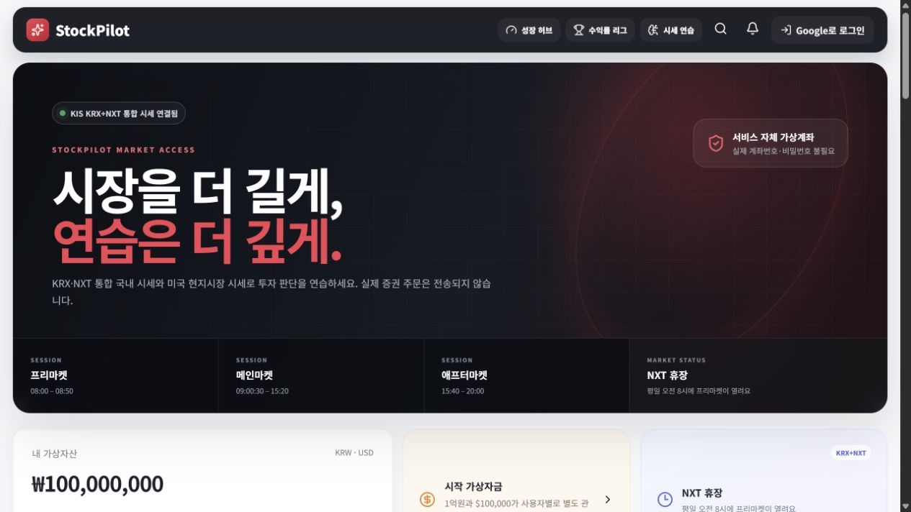
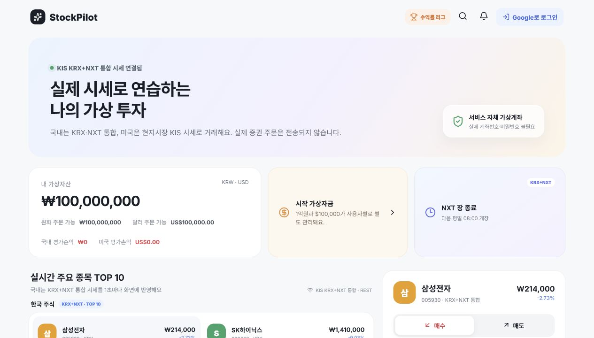

<div align="center">


# StockPilot

### 실제 시세로 배우고, 안전하게 거래하는 가상투자 플랫폼

KRX·NXT·미국주식 시세를 바탕으로 검색, 분석, 가상주문, 포트폴리오 관리와 투자 학습을 한 흐름으로 연결한 개인 프로젝트입니다.

<p>
  <a href="https://stockpilot.coders.kr"></a>
  <a href="https://github.com/boclair98/stockpilot"></a>
</p>

<p>
  
  
  
  
  
</p>

</div>

> **주의:** StockPilot의 매수·매도는 서비스 내부 가상원장에서만 처리됩니다. 실제 증권계좌로 주문을 보내지 않으며, 계좌번호·계좌 비밀번호를 요구하지 않습니다.

## 제품 기획 한눈에 보기

| 질문 | StockPilot의 답 |
|---|---|
| 누구를 위한 서비스인가요? | 주식을 처음 시작하거나, 실전 주문 전에 반복 연습하고 싶은 개인 투자자 |
| 어떤 문제를 해결하나요? | 시세를 보는 것과 주문·위험관리·복기를 따로 해야 하는 학습 단절 |
| 핵심 경험은 무엇인가요? | 실제 시장 데이터로 판단하고, 가상원장으로 체결한 뒤, KOSPI와 비교하며 성장하는 루프 |
| 무엇이 다른가요? | 종목 검색부터 주문 안전장치·투자일지·수익률 리그·시장 타임머신까지 하나의 흐름으로 연결 |
| 무엇을 약속하지 않나요? | 수익을 보장하거나 실제 거래를 대행하지 않습니다. 과거 데이터는 학습용으로만 사용합니다. |

### 사용자가 느끼는 5단계 여정

```text
발견  →  이해  →  연습  →  기록  →  성장
TOP 10     차트·뉴스     가상주문     일지·리포트     리그·타임머신
```

1. **발견:** 첫 화면에서 KRX·NXT·미국 시장 상태와 TOP 10을 즉시 확인합니다.
2. **이해:** 종목 검색, 가격 흐름, 뉴스, OpenDART 기업정보로 매매 전에 맥락을 읽습니다.
3. **연습:** 시장가·지정가·손절·조건부 주문을 가상원장에 제출하고 체결 품질을 확인합니다.
4. **기록:** 주문 근거와 목표를 투자일지에 남기고 거래 명세·리포트로 결과를 복기합니다.
5. **성장:** KOSPI 상대성과, 수익률 리그, 시장 타임머신에서 다음 의사결정을 훈련합니다.

### UX 설계 원칙

- **첫 화면은 판단에 필요한 것만:** 실시간 상태, 시장 기준선, 검색, 주문을 한 화면의 우선순위로 배치합니다.
- **핵심 여정을 한 줄로 안내:** 시장 읽기 → 종목 선택 → 안전 주문 → 기록·복기를 현재 상태와 함께 표시하고 각 단계로 바로 이동합니다.
- **초보자와 숙련자 화면 분리:** 핵심 투자 루프는 항상 보이게 유지하고, 시장 강도·집중도·급락 스트레스 테스트는 고급 체크업으로 접어 정보 과부하를 줄입니다.
- **위험은 행동 전에 설명:** 미보유 매도, 수량 초과, 시세 지연, 현금 부족을 접수 전에 한국어로 안내합니다.
- **모바일 우선, 입력 장치 독립:** 반응형 레이아웃과 하단 내비게이션을 제공하고, `/` 검색 단축키·포커스 표시·스킵 링크로 키보드와 보조기기까지 지원합니다.
- **결과보다 과정 중심:** 수익률 하나만 강조하지 않고 최대낙폭·변동성·체결비용·KOSPI 대비 성과를 함께 보여줍니다.
- **실패도 학습 데이터:** 거절된 주문과 오류 상태도 원인·request ID와 함께 남겨 사용자가 다음 행동을 알 수 있게 합니다.

## 프로젝트 소개

StockPilot은 주식을 처음 접하는 사용자가 실제 투자 서비스의 흐름을 안전하게 연습할 수 있도록 만든 모의투자 서비스입니다.

사용자는 Google 로그인 후 원화 `₩100,000,000`과 달러 `$100,000`의 가상자금을 받고, 실제 KIS 시세를 확인한 뒤 가상주문을 제출합니다. 체결 결과는 StockPilot의 PostgreSQL 원장에 기록되며, KOSPI 벤치마크·수익률 리그·투자일지·학습 미션으로 이어집니다.

### 사용 흐름

```text
Google 로그인
    ↓
실시간 시장 확인 · KOSPI 국면 확인
    ↓
종목 검색 · 차트 · 뉴스 · 기업공시 분석
    ↓
시장가/지정가/조건부 가상주문
    ↓
포트폴리오 · 체결 품질 · KOSPI 상대성과 확인
    ↓
투자일지 · 챌린지 · 수익률 리그로 복기와 성장
```

## 차별화 기능: 시장 타임머신

StockPilot은 과거 데이터를 단순히 보여주는 데서 끝나지 않고, 사용자가 실제로 판단을 내린 뒤 결과를 확인하도록 구성했습니다. 종목 상세 영역의 **시장 타임머신**을 열면 KIS 일봉 데이터에서 과거 체크포인트를 무작위로 골라 다음 10거래일을 잠급니다.

1. 체크포인트의 종가와 직전 5거래일 흐름만 확인합니다.
2. 전액 매수, 3회 분할 매수, 현금 대기 중 하나와 연습 금액을 선택합니다.
3. 선택을 확정하면 실제 과거 가격 경로로 최종 금액, 수익률, 최대낙폭, 최고·최저 하루 변동을 계산합니다.
4. 같은 구간의 다른 선택지와 나란히 비교하고, 결과를 공유할 수 있습니다.

모든 계산은 브라우저에서 수행되는 가상 시뮬레이션이며 주문 원장이나 실제 계좌를 변경하지 않습니다. 과거 결과는 미래 수익을 예측하지 않으며, 타이밍·분할·현금 보유의 차이를 체험하는 학습 도구입니다. 데이터가 부족하거나 KIS가 일시적으로 응답하지 않으면 자동으로 안내 상태로 전환합니다.

## 주요 기능

| 영역 | 기능 | 설명 |
|---|---|---|
| 시장 | KRX·NXT·미국주식 시세 | 국내 통합 거래소와 미국주식 주요 종목의 실시간 시세 제공 |
| 시장 | 전체 종목 검색 | TOP 10 외에도 한국 종목코드·종목명·미국 티커로 검색 후 바로 분석·주문 |
| 시장 | 내 관심종목 | 최대 12개 종목을 기기에 저장하고 실시간 가격·등락률과 주문 화면을 한 번에 다시 확인 |
| 시장 | 시세 최신성 표시 | 선택 종목의 마지막 갱신 시각을 방금·초·분 단위와 상태 색상으로 표시 |
| 경험 | 오늘의 투자 루프 | 시장 읽기·종목 선택·안전 주문·기록 복기의 현재 단계를 보여주고 관련 화면으로 즉시 이동 |
| 시장 | KOSPI 시장 나침반 | 5·20거래일 수익률과 변동성으로 상승장·박스권·하락장·변동성 확대를 표시 |
| 시장 | KOSPI 상대성과 | 로그인 후 내 모의투자 수익률과 KOSPI를 같은 기간으로 비교 |
| 시장 | 오늘의 투자 브리핑 | 시장 흐름·내 가상 포트폴리오 컨디션·추천 다음 행동을 한 카드에서 요약 |
| 분석 | 가격 차트 | 1주·1개월·3개월 일별 차트와 기간 수익률·고가·저가 표시 |
| 분석 | 뉴스·기업정보 | KIS 뉴스, OpenDART 한국 기업정보·공시, SEC EDGAR 미국 제출 이력 연결 |
| 보호 | 내 데이터 다운로드 | 프로필에서 내 가상거래·학습 기록을 JSON으로 내려받고 푸시 토큰은 제외 |
| 거래 | 4가지 가상주문 | 시장가, 지정가, 손절, 조건부 지정가 주문 지원 |
| 거래 | 현실형 가상체결 | 스프레드·주문 참여율·슬리피지를 반영해 체결가 계산 |
| 거래 | 안전한 매도 검증 | 미보유 종목, 보유 수량 초과, 대기 주문 중복 매도 차단 |
| 거래 | 익절·손절 보호주문 | 보유 수량에 목표가와 손절가를 설정하고 조건 충족 시 가상매도 |
| 자산 | 가상 포트폴리오 | 원화·달러 현금, 보유수량, 평균단가, 평가손익, 수익률 제공 |
| 자산 | 거래 명세서 | 모의 수수료·세금·체결 품질·주문 상태를 확인하고 CSV로 저장 |
| 성장 | 투자 리포트 | 실현손익, 승률, 최대낙폭, 변동성, 샤프비율, 슬리피지 분석 |
| 성장 | 모의투자 면허 | 실제 챌린지·체결·투자일지·보호주문·성과 기록으로 4단계 12개 위험관리 미션을 자동 판정 |
| 보호 | 금융생활 안전 리포트 | 계획 매매·손실 방어·분산 경험·복기·거래 절제를 서버 기록으로 평가하고 다음 안전 행동 안내 |
| 성장 | 투자일지·복기 | 거래 근거·목표수익률·손절기준을 작성하고 결과를 회고 |
| 성장 | 챌린지·학습센터 | 과거 차트 예측, 투자용어, 주문·위험관리 게임과 XP 기록 |
| 성장 | 시장 타임머신 | 과거 실제 시세의 체크포인트에서 전액매수·3회분할·현금대기를 선택하고 10거래일 뒤 결과·최대낙폭·학습점수를 비교 |
| 경쟁 | 수익률 리그 | 종목과 주문내역은 숨기고 닉네임·수익률·순위만 공개 |
| 경쟁 | 시즌·1:1 배틀 | 친구 초대코드로 기간형 리그와 개인 대결 진행 |
| 알림 | 목표가·브라우저 푸시 | 목표가 도달, 주문 상태와 주요 이벤트를 Firebase Web Push로 알림 |
| 커뮤니티 | 투자 라운지 | 보유자산을 공개하지 않고 투자 습관과 배움을 공유 |
| 운영 | 운영자 통제센터 | 모의거래 중지, 위험한도, 원장 대사, 감사 이벤트 확인 |

## 기술 스택

| 구분 | 기술 |
|---|---|
| Frontend | Next.js 16 App Router, React 19, TypeScript, CSS |
| Backend | Python 3.12, FastAPI, Pydantic, SQLAlchemy Async |
| Database | PostgreSQL 16, Alembic migration |
| Cache·Traffic | Redis, TTL 캐시, 분산 락, 요청 제한, single-flight |
| Database Guardrails | 비동기 연결 풀, LIFO 재사용, 연결 타임아웃, 8초 statement timeout |
| Authentication | Google OAuth 2.0, 서버 세션 쿠키 |
| Market Data | 한국투자증권 KIS Open API(WebSocket·REST) |
| Company Data | 금융감독원 OpenDART API, SEC EDGAR Submissions API |
| Push | Firebase Cloud Messaging(Web Push) |
| Deployment | Docker, Docker Compose, coders.kr 멀티서비스 배포 |
| Quality | Pytest, Ruff, ESLint, TypeScript, Next.js production build |

## 핵심 설계

### 1. 모의원장과 실시간 시세의 분리

KIS는 종목·시세·지수·뉴스 조회에만 사용합니다. 주문은 KIS 주문 API로 전송하지 않고 FastAPI가 PostgreSQL의 가상계좌·포지션·주문·감사 이벤트를 트랜잭션으로 기록합니다.

```text
KIS WebSocket/REST ──> Market Collector ──> Redis shared snapshot
                                      │
                                      ├──> 공개 시세·KOSPI API
                                      └──> 가상체결 엔진 ──> PostgreSQL 원장
```

### 2. KOSPI를 서비스 기준선으로 사용

KOSPI 지수는 단순 차트가 아니라 사용자의 투자 판단을 설명하는 기준선입니다.

- 최근 5·20거래일 시장 수익률 계산
- 일별 수익률 변동성 계산
- 상승장·박스권·하락장·변동성 확대 국면 분류
- 개인 포트폴리오와 같은 기간의 상대성과 계산
- 종목·수량·주문내역을 공개하지 않는 익명 비교

계산 로직은 `backend/app/services/benchmark.py`에 순수 함수로 분리해 API와 테스트에서 재사용합니다.

### 3. 체결 전 위험 통제

주문 접수 시점에 거래 모드, 장 운영 상태, 시세 지연, 주문금액, 일일 주문 수, 현금, 보유 수량과 중복 매도 가능 수량을 검증합니다. 실패한 주문도 거절 사유와 감사 이벤트를 남겨 재현 가능한 학습 기록으로 보존합니다.

### 3-1. 서버 기록 기반 모의투자 면허

- 브라우저 저장값이 아니라 챌린지, 체결, 투자일지, 보호주문, 일별 성과 스냅샷을 서버에서 조합합니다.
- 시장 탐색 → 리스크 조종 → 원칙 운용 → 포트폴리오 운용의 4단계와 12개 미션을 제공합니다.
- 수익률이나 거래 횟수만 보상하지 않고 손절 계획, 복기, 분산 경험과 최대낙폭 관리 습관을 함께 평가합니다.
- 기존 `/api/growth/overview` 응답에 면허 진행도를 포함해 성장 허브 첫 화면에서 추가 요청을 만들지 않습니다.

### 3-2. 금융기관 검토를 고려한 소비자보호 설계

- **수익률 비가중 안전점수:** 높은 수익이나 많은 거래를 점수로 보상하지 않고 계획, 손실 방어, 분산, 복기와 과매매 절제만 평가합니다.
- **설명 가능한 산식:** 5개 평가 항목의 현재 점수와 최대 점수, 평가 이유, 다음 행동을 사용자 화면에 그대로 공개합니다.
- **개인정보 최소수집:** 실제 은행 계좌번호·계좌 비밀번호를 받지 않으며 Google 로그인과 서비스 내부 가상원장만 사용합니다.
- **금융소비자 오인 방지:** 안전점수는 신용점수, 투자적합성 평가, 금융자격 또는 상품 추천이 아님을 화면과 API 응답에 명시합니다.
- **사전예방형 UX:** 주문 후 경고가 아니라 주문 전에 현금, 보유수량, 중복 매도, 시세 지연과 위험한도를 검증합니다.
- **감사 가능성:** 주문 접수·거절·체결과 운영자 조치를 감사 이벤트로 남겨 사고 원인을 재현할 수 있습니다.
- **접근성·모바일 대응:** 상태를 색상 하나로만 전달하지 않고 텍스트·아이콘을 함께 사용하며 작은 화면에서도 전체 지표를 읽을 수 있습니다.

> 이 저장소는 KB국민은행 또는 기타 금융기관과 제휴·승인된 서비스가 아닙니다. 특정 은행의 상표나 UI를 복제하지 않고, 금융교육·소비자보호·리스크 관리에 적합한 독립적인 모의투자 제품을 지향합니다.

### 4. 대규모 접속을 고려한 시장 데이터 처리

KIS 수집기·목표가 알림·보호주문 매처는 전용 `worker` 서비스에서 실행하고,
API replica는 짧은 요청 처리에 집중합니다. Redis lease·공유 캐시·WebSocket
fan-out을 사용해 여러 브라우저가 같은 종목을 요청해도 외부 API 호출과 JSON
직렬화를 반복하지 않도록 구성했습니다.

### 5. 사용자 증가를 대비한 운영 하드닝

- **공용 데이터 캐시:** 뉴스·일봉·기업정보는 서비스 캐시와 CDN `s-maxage`를 함께 사용해 방문자 수만큼 KIS·DART 호출이 늘어나지 않습니다.
- **초기 화면 경량화:** 차트 리플레이·공시·투자 도구·운영센터를 기능별 청크로 분리하고 화면 접근 직전에 불러와 첫 방문 JavaScript 실행량을 줄입니다.
- **실시간 렌더링 우선순위:** 1초 단위 시세 갱신은 React transition으로 처리해 검색·주문 입력이 먼저 반응하도록 구성합니다.
- **검색 체감 속도:** 검색 결과에 포인터·키보드 포커스가 도착하면 5초 TTL로 시세를 미리 요청하고, 선택 시 같은 요청을 재사용합니다.
- **검색 CPU 절감:** 전체 종목의 정규화 문자열을 적재 시 한 번만 만들고 `heapq.nsmallest`로 상위 결과만 선별해 대규모 종목 검색의 반복 정규화·전체 정렬을 제거합니다.
- **세션 요청 절감:** 사용자 프로필은 로그인 상태가 바뀔 때만 갱신하고, 10초 포트폴리오 폴링에서는 제외해 인증 API와 브라우저 작업을 줄입니다.
- **오프스크린 렌더링 절감:** 긴 종목·분석 영역은 IntersectionObserver와 `content-visibility`를 함께 사용해 보이지 않는 UI의 레이아웃·페인트 비용을 늦춥니다.
- **정확 조회 인덱스:** 종목 코드·시장·거래소 복합 키를 메모리 인덱스로 유지하고, 주문·알림·보호주문 상태 조회에는 PostgreSQL 복합 인덱스(`0012_scale_hot_paths`)를 적용합니다.
- **중복 워커 방지:** Redis lease로 알림·보호주문·시세 수집 리더를 한 인스턴스로 제한하고, 같은 종목의 워커 시세 조회도 poll 단위로 합칩니다.
- **장애 격리:** Redis가 잠시 끊겨도 로컬 fallback으로 읽기·로그인을 유지하되, 운영 워커 lease는 fail-closed로 중복 실행을 막습니다. readiness probe가 DB·Redis·시세 상태를 분리해 표시합니다.
- **시세 지연 격리:** KIS REST 슬롯을 제한 시간 안에 획득하지 못하거나 upstream이 느리면 사용자 요청을 빠르게 종료해 API worker가 무한 대기하지 않습니다. 오래된 시세로 주문을 체결하지 않는 정책도 유지합니다.
- **캐시 미스 single-flight:** 같은 키의 첫 갱신을 한 요청만 수행하고 다른 replica는 공유 결과를 기다려, 인기 종목의 동시 cache miss가 KIS 호출 폭주로 번지지 않게 합니다.
- **실시간 연결 보호:** WebSocket handshake에도 사용자/IP별 동시 연결 슬롯과 만료 lease를 적용하고, 브라우저는 지수 백오프·jitter로 재연결해 장애·새로고침 폭주를 흡수합니다.
- **부팅 경량화:** production API·worker는 컨테이너마다 migration을 실행하지 않습니다. 배포 전 one-shot migration을 완료한 뒤 readiness를 통과한 replica만 트래픽을 받습니다.
- **요청 보호:** 사용자/IP별 읽기·쓰기 rate limit과 API/nginx 본문 크기 제한을 적용하고, 모든 응답에 request ID·보안 헤더를 남겨 추적과 abuse 대응을 가능하게 합니다.

이 보호장치는 “무제한 트래픽”을 보장한다는 뜻이 아니라, 실제 사용자가 늘 때 외부 API·DB·워커가 먼저 무너지는 것을 막는 운영 기준선입니다. 배포 전에는 `docs/OPERATIONS_RUNBOOK.md`의 migration·백업·부하 점검 절차를 따라야 합니다.

## 도메인 구조

```text
app
├── routes
│   ├── trading.py       # 시세·검색·주문·포트폴리오·KOSPI
│   ├── growth.py        # 챌린지·투자일지·분석·KOSPI 벤치마크
│   ├── league.py        # 공개 리그·시즌방·1:1 배틀
│   ├── company.py       # OpenDART 기업·재무·공시
│   ├── engagement.py    # 목표가·리포트·관심종목·푸시
│   ├── auth.py          # Google OAuth 세션
│   └── operations.py    # 운영 통제·대사·감사
├── services
│   ├── kis_market.py    # KIS REST/WebSocket 수집 및 캐시
│   ├── benchmark.py     # KOSPI 수익률·시장 국면 계산
│   ├── execution_quality.py
│   ├── risk_engine.py
│   ├── portfolio_analytics.py
│   ├── protection_matcher.py
│   └── reconciliation.py
├── core
│   ├── database.py
│   ├── identity.py
│   ├── traffic.py
│   ├── security.py
│   └── order_integrity.py
└── models.py            # 사용자·가상원장·리그·알림·감사 모델
```

`app/worker.py`와 `worker.Dockerfile`은 장시간 실행되는 시세·알림·보호주문
작업을 API replica와 분리한 내부 worker 서비스입니다.

## 문서

| 문서 | 내용 |
|---|---|
| [증권사 도입 준비 기준](docs/BROKERAGE_READINESS.md) | 실제 금융권 수준으로 확장할 때 필요한 통제와 미충족 범위 |
| [금융권 연동 준비 목록](docs/INSTITUTIONAL_INTEGRATION.md) | 계약·API·접속자료·운영 협의 체크리스트 |
| [운영 런북](docs/OPERATIONS_RUNBOOK.md) | 배포 전 백업, migration, Redis, 장애 대응 절차 |
| [플랫폼 정책](PLATFORM.md) | coders.kr 인증, 요청 제한, 캐시, WebSocket 운영 기준 |
| [보안 정책](SECURITY.md) | 취약점 신고 및 Secret 관리 원칙 |

## 주요 API

| Method | Endpoint | 역할 | 인증 |
|---|---|---|:---:|
| `GET` | `/api/trading/bootstrap` | 첫 화면용 시세·장 상태·KOSPI 스냅샷 | 선택 |
| `GET` | `/api/trading/quotes` | 국내·미국 TOP 10 시세 | 없음 |
| `GET` | `/api/trading/search` | 전체 종목 검색 | 없음 |
| `GET` | `/api/trading/kospi` | KOSPI 현재값·30거래일 | 없음 |
| `GET` | `/api/growth/benchmark` | KOSPI 국면·5/20거래일 수익률·상대성과 | 선택 |
| `GET` | `/api/trading/portfolio` | 개인 가상잔고·포지션·주문 | 선택 |
| `POST` | `/api/trading/orders` | 가상주문 접수 및 체결 | 필요 |
| `GET` | `/api/trading/statement` | 개인 계좌 명세·거래 규칙 | 선택 |
| `GET` | `/api/features/history` | 종목 일별 차트 | 없음 |
| `GET` | `/api/features/news` | 종목 뉴스 | 없음 |
| `GET` | `/api/company/{symbol}` | 한국 기업정보·재무·공시 | 없음 |
| `GET` | `/api/company/us/{symbol}` | SEC EDGAR 미국 제출 이력 | `SEC_USER_AGENT` |
| `GET` | `/api/me/export` | 내 개인정보·가상거래 기록 JSON 다운로드 | 필요 |
| `GET` | `/api/league/rankings` | 공개 수익률 리그 | 선택 |
| `GET` | `/api/growth/analytics` | 리스크·성과·체결품질 분석 | 필요 |
| `WS` | `/api/trading/ws` | 실시간 시세 스트림 | 없음 |

## 프로젝트 구조

```text
stockpilot
├── frontend
│   ├── app/                    # Next.js 라우트·페이지·반응형 스타일
│   ├── components/             # 시장·주문·성장·리그 UI
│   │   ├── MarketBriefing.tsx    # 시장·포트폴리오·다음 행동 요약
│   │   ├── MarketReplayStudio.tsx # 과거 시세 의사결정 리플레이
│   ├── lib/                    # API·Firebase·학습 콘텐츠 유틸리티
│   ├── Dockerfile
│   └── package.json
├── backend
│   ├── app/                    # FastAPI 애플리케이션
│   ├── alembic/                # DB migration
│   ├── tests/                  # 통합·보안·위험관리 테스트
│   ├── unit_tests/             # 외부 의존성 없는 도메인 테스트
│   ├── Dockerfile
│   └── pyproject.toml
├── docs/                       # 운영·금융권 연동·준비 문서
├── compose.yaml                # 로컬 PostgreSQL·Redis·API·Web
├── coders.yaml                # coders.kr 배포 정의
└── README.md
```

## 화면 미리보기

<table>
  <tr>
    <td align="center"><br /><b>시장 대시보드</b></td>
    <td align="center"><br /><b>KOSPI 기준선</b></td>
  </tr>
  <tr>
    <td align="center"><br /><b>전체 종목 검색</b></td>
    <td align="center"><br /><b>서비스 흐름</b></td>
  </tr>
</table>

## 시작하기

### 요구사항

- Docker Desktop
- Git
- KIS Open API 키·시크릿(시세 연동 시)
- Google OAuth Client(로그인 연동 시)
- OpenDART API Key(한국 기업정보·공시 연동 시)
- SEC User-Agent(미국 공시 연동 시, 이메일 포함 식별 문자열)

### 로컬 실행

```bash
git clone https://github.com/boclair98/stockpilot.git
cd stockpilot
docker compose up --build
```

실행 후 다음 주소에서 확인합니다.

| 서비스 | 주소 |
|---|---|
| Web | http://localhost:3000 |
| API | http://localhost:8000 |
| API health | http://localhost:8000/api/health |

### 환경변수

```bash
cp backend/.env.example backend/.env
```

운영 환경에서는 다음 값을 Secret으로 주입합니다.

```env
DATABASE_URL=postgresql+asyncpg://...
REDIS_URL=redis://...
MAX_REQUEST_BODY_BYTES=64000
KIS_APP_KEY=...
KIS_APP_SECRET=...
KIS_ENV=paper
GOOGLE_CLIENT_ID=...
GOOGLE_CLIENT_SECRET=...
DART_API_KEY=...
FIREBASE_SERVICE_ACCOUNT_B64=...
```

KIS는 시세 조회에만 사용하며, 실제 주문 API 자격증명은 이 프로젝트에 사용하지 않습니다.

## 테스트와 품질 게이트

```bash
# 백엔드
cd backend
uv run pytest -q
uv run ruff check app tests unit_tests

# 프런트엔드
cd frontend
pnpm lint
pnpm build
```

현재 KOSPI 벤치마크·시뮬레이션 규칙·주문 검증·보안·리그·성장 기능에 대한 자동 테스트를 포함합니다.

## 운영 서비스와 진행 상황

- 운영 URL: [https://stockpilot.coders.kr](https://stockpilot.coders.kr)
- 공개 저장소: [https://github.com/boclair98/stockpilot](https://github.com/boclair98/stockpilot)
- 배포 방식: `coders.yaml` 기반 web/api/worker 분리 배포
- 현재 상태: KRX·NXT·미국주식 시세 기반 모의투자 서비스 운영 중

### 다음 개선 후보

- 종목 마스터와 기업 로고 데이터의 정기 업데이트 파이프라인
- 더 긴 기간의 KOSPI·포트폴리오 시계열 저장과 리밸런싱 분석
- 부하 테스트 결과에 따른 Redis·PostgreSQL 용량 조정
- 실제 금융권 도입 시 필요한 개인정보·감사·재해복구·규제 검토

## 책임 범위

StockPilot은 학습과 경험을 위한 가상투자 서비스입니다. 표시되는 시세는 데이터 제공자 정책과 네트워크 상황에 따라 지연될 수 있으며, 수익을 보장하지 않습니다. 실제 금융상품 매매나 투자자문 서비스로 사용하려면 별도의 법률·규제·보안·운영 검토가 필요합니다.

## License

개인 프로젝트입니다. 상업적 사용·재배포 전에는 저장소 관리자에게 문의해 주세요.

